# Gauge

Smart Maintenance Tracking for Car Enthusiasts

Gauge is a simple iOS application designed to help you keep track of your car's maintenance and mileage. It acts as a digital logbook, ensuring you always know when your last service was and when the next one is due.

Unlike standard apps that rely on simple time intervals, Gauge learns your driving habits to predict exactly when your next service is due.

## Application Overview

### HomeView

The landing page displays your vehicle's make, model, and current mileage. It serves as your dashboard for quick status checks and rapid data entry.

**Quick Actions:** Immediately update your odometer or add a new maintenance item.

**Status at a Glance:** See your vehicle's health instantly.

(Insert HomeView screenshot here)

### MaintenanceView

A comprehensive tab showing all recorded maintenance and modification items.

**Detailed History:** Tap any item to see a log of every service date and mileage.

**Upcoming:** Items are sorted by urgency, highlighting what needs attention next.

(Insert MaintenanceView screenshot here)

### SettingsView

Manage your vehicle profile and application preferences.

**Vehicle Profile:** Update car details or switch vehicles.

**Data Management:** Options to reset data or resync with the cloud.

**Debug Tools:** Built-in tools for testing notifications and connections.

### MaintenanceView

Detail of applications features and initialization of user data.

(Insert SettingsView screenshot here)

## Tech Stack

### Core Frameworks

**SwiftUI** - User Interface

**MVVM** - Design Pattern (Model-View-ViewModel)

**Combine** - Reactive Data Binding

**UserNotifications** - Local Predictive Alerts

### Backend & Cloud (AWS)

**AWS DynamoDB** - NoSQL Database for scalable storage.

**AWS Cognito** - Secure User Authentication and Identity Management.

**AWS Mobile SDK** - Native Swift integration for AWS services.

### Local Persistence

**UserDefaults** - Caching for "Offline First" capability.

## System Architecture

Gauge is built using a "Cloud First, Local Logic" approach. While data is stored securely in AWS, all predictive mathematics and notification scheduling happen locally on the device to ensure privacy and performance.

### 1. High-Level App Flow

How data moves from the user's finger to the cloud.


### 2. Data Synchronization Logic

How Gauge handles data consistency. When a user adds an item, we update the local state immediately for UI responsiveness, then sync to AWS in the background.

```mermaid
%%{init: { 'sequence': {'mirrorActors': false} } }%%
sequenceDiagram
    participant User
    participant VM as CarDataStore
    participant AWS as AWS DynamoDB

    User->>VM: Add Maintenance Item ("Oil Change")
    VM->>VM: Update Local List (UI Updates Instantly)
    VM->>AWS: Async Write Request
    AWS-->>VM: Success Confirmation
    VM->>VM: Update Connection Status "✅ Saved"
```



### 3. The "Set & Forget" Notification System

Gauge does not use a backend server to push notifications. Instead, it uses a smart local algorithm. Every time the odometer is updated, the app recalculates the user's daily driving rate and reschedules alerts.


## How to Run This Project

To run Gauge on your local machine:

1. **Clone the Repo:** Download the source code.

2. **Open in Xcode:** Open `Guage.xcodeproj`.

3. **Signing:** Ensure you have a valid developer signing certificate selected in the project settings.

4. **AWS Configuration (Crucial):** This app requires a `Secrets.swift` file for AWS configuration, which is not included in the public repository for security reasons. Create this file in the root directory:

```swift
struct Secrets {
    static let cognitoPoolId = "YOUR_POOL_ID"
    static let dynamoTableName = "YOUR_TABLE_NAME"
}
```

5. **Build & Run:** Select your target simulator or device and hit Run (Cmd+R).
